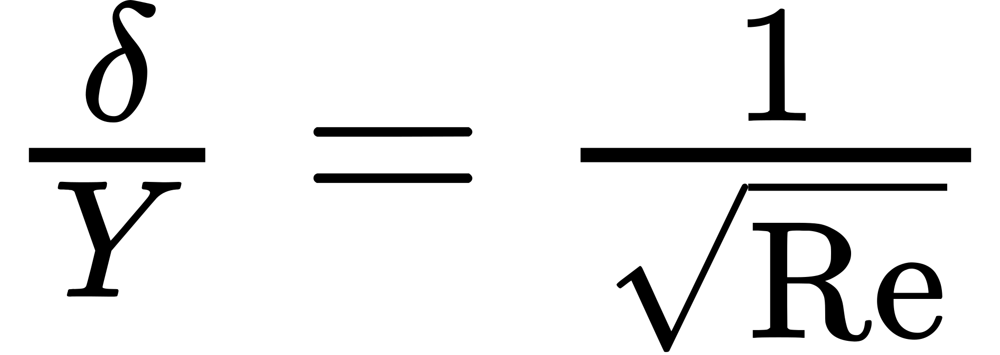

# natural convection
## Introduction

### Boundary Layer
Let's consider a wall in the 2D plane <!-- $(x, y)$ -->  and a fluid moving along.    
As the fluid is flowing along the fixed wall, its speed is zero at the wall. 
Far away from this wall, the fluid speed is not influenced by the wall.

In a small area near the wall, the speed of the several layers of the fluid vary strongly. We call this area **boundary layer**.


### Natural convection
Natural convection happens in a fluid when a gradient (_in our case, it will be a gradient of **temperature**_) induce a movement in the fluid.

The aim of this project is to analyse the **motion** and the **heat flow** of a 2D _stationnary_ and _incompressible_ fluid.

### Finding a similarity equation
The **motion** of the 2D fluid in the **boundary layer** is governed by the **Prandtl equations**. 

Let <!-- $(x, y) \in \mathbb{R}^2$ -->  a point in the plane.    
Let <!-- $(u, v) \in \mathbb{R}^2$ -->  the speed of the fluid at every point in the plane.    

We consider the wall to be an infinitesimal vertical plate fixed at $y = 0$.

#### Simplifications 
We make the following hypotheses :   

- The fluid is sitcking to the plate : <!-- $v = 0$ -->  at <!-- $x = 0$ --> .
- Far away from the plate, the fluid is not moving : <!-- $u = v = 0$ --> .
- The fluid is warmer near the plate: <!-- $T_w > T_e$ --> .
- The width of the boundary layer is negligible compared with the its height: <!-- $\delta << Y$ --> .

Therefore, we can use the **Prandtl equations** along with a term linked to **buoyancy** and ignoring the **viscous dissipation**.

#### Prandtl Hypotheses 
- The flow has **big Reynolds number**.
- The width of the **boundary layer** depends on **Reynolds number** : <!-- $\frac{\delta}{Y} = \frac{1}{\sqrt{\text{Re}}}$ --> .
- Forces of inertia, of pressure and of viscosity **are of the same order in the boundary layer**.
- We consider **buoyancy** therefore the pressure only depends on the depth: <!-- $P(x, y) = \rho g \cdot y$ --> .

Then we can obtain a **similitarity equation** defining,
<!-- $$
\begin{align}
  \eta(x, y) 
    &= \frac{x}{\delta(y)} \\
    &= \frac{x}{y} \left( \frac{\text{Gr}(y)}{y} \right)^{1/4}
\end{align}
$$ --> 

<div align="center"></div>

where **Gr** is the **Grasshof number**,
<!-- $$
\begin{align}
  \text{Gr} 
    &= \frac{\text{"buoyancy"} \cdot \text{"inertia term"}}{(\text{"viscous forces"})^2} \\
    &= \frac{\beta \Delta T g L^3}{\nu^2}
\end{align}
$$ --> 

<div align="center"></div>

The complete derivation of the **similarity equations** from the **2D Navier Stokes equations** is available [here](/report/natural_convection_blasius_2d_derivation.pdf).

### Numerical simulation
From the **2D Navier Stokes equations** that are **Partial Differential Equations (PDE)** we have derived the 2 following **similarity equations** that are **Ordinary Differential Equations (ODE)**.

<!-- $$
\begin{cases}
  f'''(\eta) + 3 f(\eta) f''(\eta) - 2 \left( f'(\eta) \right)^2 + \theta(\eta) &= 0 \\
  3 \text{Pr} \cdot f(\eta) \theta'(\eta) + \theta''(\eta) &= 0
\end{cases}
$$ --> 

<div align="center"></div>

- **Pr** is the **Prandtl number**.
- **f** is the **dimensionless fluid position**.
- **<!-- $\theta$ --> ** is the **dimensionless fluid temperature**.

We have the following **boundary conditions**,
- <!-- $f(0) = 0$ -->  ; <!-- $f'(0) = 0$ -->  ; <!-- $\theta(0) = 1$ --> 
- <!-- $f'(\eta \rightarrow \infty) = 0$ -->  ; <!-- $\theta(\eta \rightarrow \infty) = 0$ --> 

In order to simulate that. We cannot simply use solver like _RK4_ because it only works with _initial conditions_. Here we have _boundary conditions_.

A way to solve this problem is to make use of the **shooting method** that allows to "converts" _boudary conditions_ into _initial conditions_ in order to use RK4 afterwards.   

Shooting Method : https://en.wikipedia.org/wiki/Shooting_method    
Newton Method : https://en.wikipedia.org/wiki/Newton%27s_method    
Shooting example in Python : https://nicoguaro.github.io/posts/numerical-20/    

### Installation
Clone the project
```bash
$ git clone https://github.com/Mathieu-R/natural-convection
```

Create virtual environment
```bash
$ python3 -m venv <env-name>
$ source env/bin/activate
$ python3 -m pip install --upgrade pip
```

Install required packages
```bash
$ python3 -m pip install -r requirements.txt
```

### Documentation

Shooting method : https://kyleniemeyer.github.io/ME373-book/bvps/shooting-method.html     
Flat Plate : https://nbviewer.jupyter.org/github/Jpescudero/Laminar-Thermal-Flat-Plate/blob/master/Flat_Plate_Notebook.html    
Similiarity solution for boundary layer : https://www.sciencedirect.com/science/article/pii/S2090447912000858    
